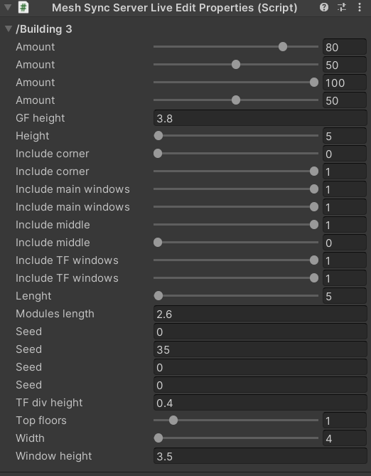

# Bidirectional Sync

When using [MeshSyncDCCPlugins](https://docs.unity3d.com/Packages/com.unity.meshsync.dcc-plugins@latest) of DCC tools that 
have Bidirectional Sync support, MeshSync will add editable properties in Unity, and changes to these properties will be applied back to the DCC tool.
  

When applicable, MeshSync will add a MeshSyncServerLiveEditProperties component to the [MeshSyncServer](MeshSyncServer.md) **GameObject**
and put the editable properties in it.

Please refer to the documentation of [MeshSyncDCCPlugins](https://docs.unity3d.com/Packages/com.unity.meshsync.dcc-plugins@latest)
for more details on these properties.
