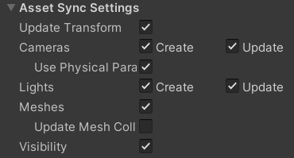
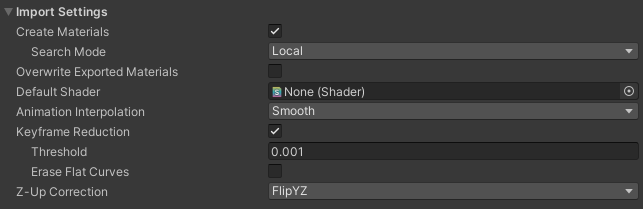
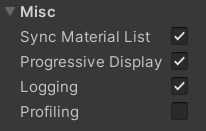
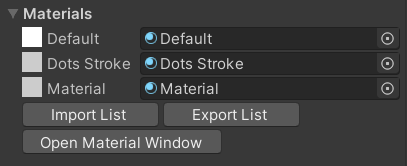
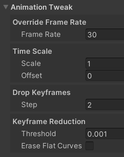

# Common MeshSync Properties

These properties are shared by multiple components in this package.

## Asset Sync Settings

|**Properties** |**Description** |
|:---       |:---|
| Update Transform      | updates the position, rotation, and scale of each applicable **GameObject**.|
| Cameras               | **Create**: create camera **GameObjects**.   **Update**: update camera properties.|
| Use Physical Params   | update physical camera properties.|
| Cameras               | **Create**: create light **GameObjects**.   **Update**: update light properties.|
| Meshes                | create and update the MeshRenderer or SkinnedMeshRenderer component of the **GameObject**.|
| Update Mesh Colliders | create and update MeshCollider properties of **GameObjects** which have meshes if the meshes are updated.|
| Visibility            | enable/disable relevant components based on the visibility flag in the source data.|

> Tips: disabling **Sync Meshes** brings better performance, and is recommended if syncing meshes is not necessary, 
> for example, when editing only the pose/animation.

## Import 
   

- **Create Materials**: finds existing materials based on their names using the **Search Mode**
  and applies them to relevant **GameObjects**.  
  If the material is not found, then a new material is created.  
  All materials are always added to the [material list](#material-list) of the component.

  |**Search Mode**  |**Description** |
  |:---             |:---|
  | Local           | search in the local folder of the MeshSync component.|
  | Recursive-Up    | search starting from the local folder of the MeshSync component up to the Assets folder.|
  | Everywhere      | search in all Unity Project folders.|

- **Animation Interpolation**: sets the animation interpolation method.   

  |**Values** |**Description** |
  |:---       |:---|
  | Smooth    | smoothly interpolate animation curves.|
  | Linear    | do linear interpolation between neighboring animation keys.|
  | Constant  | disable interpolation.|

  > For use cases in film productions, "Constant" may be preferable to match 
  > the number of animation samples to the target framerate on the DCC side.

- **Keyframe Reduction**: performs keyframe reduction when importing animations.  
  - **Threshold**: the error tolerance.   
    Higher threshold means less number of keys and higher errors, and vice versa.   
  - **Erase Flat Curves**: delete curves that have no change (flat).
  
- **Z-Up Correction**  
  Specifies how to convert Z-Up to Y-Up for data from DCC tools 
  which have Z-Up coordinate system (3ds Max, Blender, etc).

  |**Values** |**Description** |
  |:---       |:---|
  | Flip YZ   | converts all vertices of Transform and Mesh to Y-Up.|
  | Rotate X  | converts the root object's Transform to a Y-Up by applying a -90 X axis rotation to the root object, leaving the mesh in Z-Up.|

  > "Flip YZ" works better in most cases.   
  > For reference, Unity's standard FBX Importer does the equivalent of "Rotate X".

## Misc 
   

- **Sync Material List**  
  When enabled, changing an object's material in the Scene view will update the [material list](#material-list),
  and other objects which use the previous material will be updated to use the new material.

- **Progressive Display**  

  |**Values** |**Description** |
  |:---       |:---|
  | On        | scene updates will be reflected while receiving data in real-time.|
  | Off       | updates will be reflected after all of the scene data is received.|

## Material List
   

This material list holds all the materials that are used by this MeshSync component.   
Changing a material in this list will update objects that use the previous material 
to use the new material.

**Import List** and **Export List** buttons are used to load and save material lists.    

## Animation Tweaks 

Properties to tweak animations.

- **Override Frame Rate**    
  Changes the frame rate while keeping the key time or the animation length.    

  > Tips: playing a 24 FPS animation without interpolation when targetting 60 FPS will cause jittery movements.
  > Changing the animation to 120 FPS is one possible approach to mitigate it. 
     
- **Time Scale**       
  - **Scale**: applies time scaling.   
    For example, applying 0.5 will double the speed.  
  - **Offset**: adds an offset for the specified seconds.    
    For example, applying a scale of -1 and an offset of -5 to a 5 second animation will result in reverse playback.    
- **Drop Keyframes**: drops keyframes.   
  If we apply **Step=2** to an animation with 30 keystrokes, then the odd frames will be removed and the animation will become 15 frames.   
  Similarly, if **Step=3**, then the animation will become 10 frames.

## Export Assets 

  
Export meshes/materials into asset files, in order to reuse them in other scenes or projects.  
Normally, meshes/materials synced using MeshSync only exist in the active scene.

