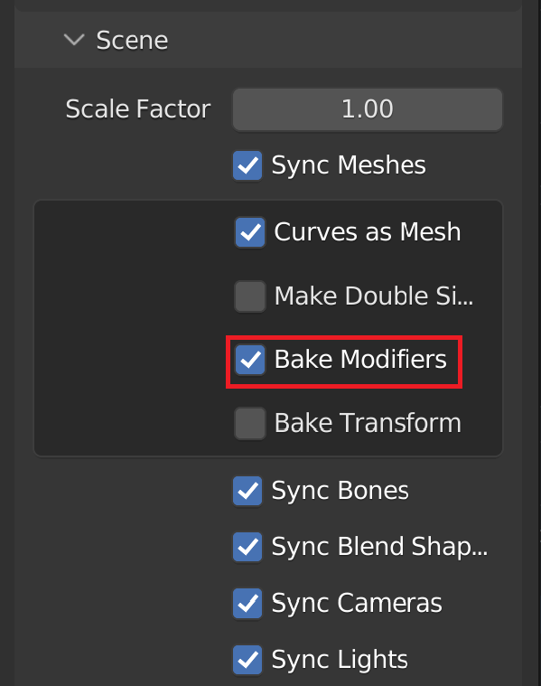

# Blender Geometry Nodes

## Enabling Geometry Node
Geometry node instances are synched by default.

## Disabling instances
To stop rendering instances of an object, click on the gameobject corresponding to the Blender object that has the geometry node modifier which generates the instances. Find the MeshSyncInstanceRenderer component  that has a reference to the instanced object. Disable the component to disable the instances.

## Controlling instances
You can control the rendering and world transform of instances by modifying the gameobject that is being instantiated.

Changes in the following properties are automatically applied on instances:
* Transform: 
    * Position
    * Rotation
    * Scale
    * Layer
* MeshRenderer:
    * Cast Shadows
    * Receive Shadows
    * Light Probes
    * Proxy Volume Override
* SkinnedMeshRenderer: 
    * Cast Shadows
    * Receive Shadows
    * Light Probes
    * Proxy Volume Override

## Runtime-builds
You can create Runtime builds that render instances from Geometry Nodes. Before building, make sure that the required instancing variants are not stripped by selecting the _Keep All_ or _Strip Unused_ option in _Project Settings_ &rarr; _Graphics_ &rarr; _Shader Stripping_ &rarr; _Instancing Variants_.

## Limitations

### Scene Cache
Exportation of instances to a Scene Cache file is not supported.

### Preview Window
Rendering instances on the inspector preview window is not supported.

### Creating prefabs
Creating prefabs for instances is not supported.

## Tips
For some files to sync correctly, the Bake Modifiers option must be selected.

