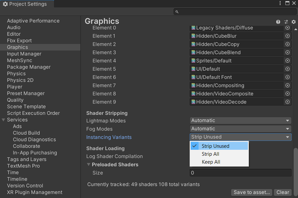

# Geometry Nodes Synchronization

Geometry Nodes is a feature for modifying the geometry of an object with node-based operations that 
is currently only provided by Blender.   
Meshsync will also automatically synchronize geometry node instances during DCC &rarr; Unity synchronization.

## Operations

### Disabling Instances

To stop rendering instances of an object:
1. Click on the **GameObject** corresponding to the Blender object that has the geometry node modifier which generates the instances. 
2. Find the MeshSyncInstanceRenderer component that has a reference to the instanced object. 
3. Disable the component to disable the instances.

### Controlling instances

We can control the rendering and world transform of instances by modifying the **GameObject** that 
is being instantiated.

Property changes in the following components are automatically applied on instances:

|**Components** |**Properties** |
|:---                 |:---|
| Transform           | * Position   * Rotation   * Scale   * Layer|
| MeshRenderer        | * Cast Shadows    * Receive Shadows   * Light Probes   * Proxy Volume Override|
| SkinnedMeshRenderer | * Cast Shadows   * Receive Shadows   * Light Probes   * Proxy Volume Override|

## Runtime-Builds

We can create Runtime builds that render Geometry Nodes instances.      
For this, make sure that the required instancing variants are not stripped by 
selecting _Keep All_ or _Strip Unused_ option in _Project Settings_ &rarr; _Graphics_ &rarr; _Shader Stripping_ &rarr; _Instancing Variants_.

## Limitations

Currently, this geometry nodes synchronization feature has the following limitations:
1. No [SceneCache](SceneCache.md) support.    
   Importing instances from a SceneCache file is not supported.
2. No Preview in the Inspector window.   
   Previewing instances inside an asset in the Inspector window is not supported.   
