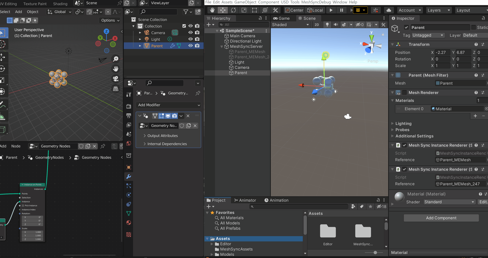

# Blender Geometry Nodes

## Enabling geometry nodes
Geometry nodes support is active by default. There are no additional steps required to sync them.

## Controlling instances
You can control the rendering and world transform of instances by modifying the gameobject that is instantiated.

Changes in the following properties are automatically reflected on instances:
Transform: 
Position,
 Rotation, 
Scale
Layer
MeshRenderer:
	Cast Shadows
	Receive Shadows
	Light Probes
	Proxy Volume Override
SkinnedMeshRenderer:
	Cast Shadows
	Receive Shadows
	Light Probes
	Proxy Volume Override

## Disabling instances
To stop rendering instances of an object, click on the gameobject corresponding to the Blender object that has the geometry node modifier. Find the MeshSyncInstanceRenderer component  that has a reference to the instanced object and disable it. The instances will stop rendering. Enable the component to render the instances again.

## Runtime-builds
You can create Runtime builds that render instances from Geometry Nodes. Before building, you must ensure that the required instancing variants are not stripped by selecting the Keep All or Strip Unused option on Project Settings > Graphics > Shader Stripping > Instancing Variants

## Limitations

### Scene Cache
Exportation of instances to a Scene Cache file is not supported.

### Preview Window
We do not support rendering instances on the inspector preview window.

### Creating prefabs
We do not support creating prefabs for instances.
