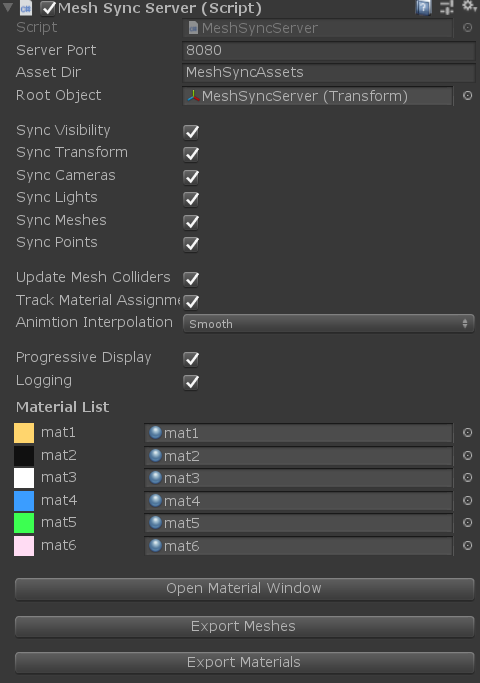
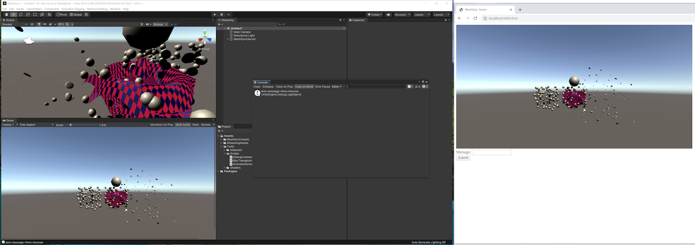

# MeshSyncServer

A component to sync meshes/models editing in DCC tools into Unity in real time.

- **Auto Start**  
  On: automatically start the server using the specified port.  
  Off: click **Start/Stop** button to start/stop the server manually.

  > Caveat: in a public network, other users will have access to MeshSync as well when the server is running. 
  > For example: they may view our Unity screen.

- **Root Object**  
  Designate a **GameObject** as the root for objects generated by the sync process.  
  If empty, the objects will be created in the root. 

- **Sync Visibility, Sync Transform, etc.**  
  Settings for enabling/disabling the sync of the applicable properties.
  This is useful for confirming the results precisely, such as the physics simulation behavior in Play mode
  without being overridden by the transform sync.

  - **Update Mesh Colliders**
    if enabled and the mesh is updated, update MeshCollider properties as well.

- **Animation Interpolation** : Sets the animation interpolation method.   

  |**Values** |**Description** |
  |:---       |:---|
  | Smooth    | smoothly interpolate animation curves.|
  | Linear    | do linear interpolation between neighboring animation keys.|
  | Constant  | disable interpolation.|

  > Constant or no interpolation may be preferable for films to match 
  > the number of animation samples to the target framerate on the DCC side.

- **Keyframe Reduction**  
Perform keyframe reduction when importing animations.  
  - **Threshold**: the error tolerance.   
  The number of keys will decrease is the threshold increases, but the error will increase as well.   
  - **Erase Flat Curves**: delete curves that have no change (flat).
  
- **Z-Up Correction**  
This setting is related only to 3ds Max and Blender which coordinate system is Z-Up, and specifies how to convert Z-Up to Y-Up.  
"Flip YZ" converts all vertices of Transform and Mesh to Y-up.  
"Rotate X" converts the root object's Transform to a Y-up by applying a -90 X rotation to the root object, leaving the Mesh as a Z-up.  
In many cases, "Flip YZ" is preferable. For reference, Unity's standard fbx Importer does the equivalent of "Rotate X".

- **Material List**  
MeshSyncServer and [SceneCachePlayer](SceneCache.md) maintain a list of materials.   
Changing the materials in this list will apply the changes in the corresponding objects.
  - If **Sync Material List** is enabled, changes in an object's material will be reflected in the material list and propagated to other objects with the same material.
  - We can save and load the list with **Import List, Export List**.  
  When updating the cache file, this can be used to carry over the materials. 

- **Progressive Display**  
On: mid-reception scene updates will be reflected in real-time.  
Off: updates will be reflected after all of the scene data is received. 

- **Animation Tweak**  
Basic animation adjustments.
  - **Override Frame Rate**: change the frame rate.    
  Unlike Unity's standard "Set Sample Rate", only the frame rate changes, but not the key duration or the animation length.   
  Playing a 24 FPS animation without interpolation in an environment of 60 FPS will cause jittery movements. In this case, a possible option would be to change the animation to 120 FPS to mitigate it.  
  - **Time Scale**: perform time scaling.   
  For example, applying 0.5 will double the speed.  
       - **Offset** adds an offset for the specified seconds.    
    For example, applying a scale of -1 and an offset of -5 to a 5 second animation will result in reverse playback.    
  - **Drop Keyframes**: drop keyframes.   
  If we apply **Step=2** to an animation with 30 keystrokes, then the odd frames will be removed and the animation will become 15 frames.   
  Similarly, if **Step=3**, then the animation will become 10 frames.
  

- **Make Asset**  
Meshes which are created by editing in DCC tools are objects that only exist in the scene where they are created. 
In order to use them in other scenes or projects, we can save them as asset files by clicking the "Export Mesh "button.

# Tips

- Starting from Unity 2019, a maximum of 255 bones can be used, allowing MeshSync to sync models that require a lot of bones, such as facial animations.
  See [Quality Settings-Blend Weights](https://docs.unity3d.com/Manual/class-QualitySettings.html#BlendWeights) for more detail.

- The sync process is done via TCP/IP, so Unity and the DCC tool can be located on separate machines.   
  To set up this connection, go to the client DCC tool's Server/Port setting and designate the machine running Unity.

- When there is a MeshSyncServer object in the scene in Unity, we can open the server's address:port in our browser to view the server's 
  Unity GameView via the browser (the default is [127.0.0.1:8080](http://127.0.0.1:8080)).  
  If a message is sent from the browser's message form, that message will appear in Unity's Console. This communication method can be useful when Unity and the DCC tool are being used by different people. 

  

- If only the pose/animation are being edited, we recommend disabling **Sync Meshes** in MeshSyncServer component, which can make the performance lighter.

# Caveats

- When MeshSyncServer runs, it will automatically copy required MeshSync assets to *StreamingAssets/MeshSyncServerRoot*.  
  Please keep them as they are.

- Although this package is designed to be used in the Editor, model syncing will still work in runtime as well, but not the animations.  
**For performance reasons, make sure that the syncing is not executed in the final build, unless it is required.**

- It is possible to use this package in Unity 2018 and earlier, but bear in mind that the maximum number of bones per vertex is 4 in these earlier versions of Unity.   
If the model is using too many bones, the model won't sync correctly. 

