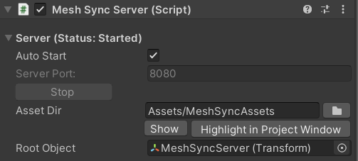

# MeshSyncServer

A component to sync meshes/models editing in DCC tools into Unity in real time.  
This sync process is done via TCP/IP, allowing developers to use DCC tools in different machines, and 
this connection can be configured in the server/port settings of 
the [MeshSync DCC Plugin](https://docs.unity3d.com/Packages/com.unity.meshsync.dcc-plugins@latest)
installed in the appropriate DCC tool.

## Properties

- **Auto Start**  

  |**Values** |**Description** |
  |:---       |:---|
  | On        | automatically start the server using the specified port.|
  | Off       | start/stop the server manually by clicking the **Start/Stop** button.|

  > Caveat: in a public network, other users will have access to MeshSync as well when the server is running. 
  > For example: they may view our Unity screen.

- **Asset Dir**  
  The local folder of the component where synced assets will be created. 

- **Root Object**  
  Designate a **GameObject** as the root for objects generated by the sync process.  
  If empty, the objects will be created in the root. 

Please refer to [common properties](CommonMeshSyncProperties.md) for details on the other properties.

## Tips

When there is a MeshSyncServer object in the scene in Unity, we can:

- view Unity's Game view in the browser by typing MeshSyncServer's IP address and port in the URL box
  (the default is [127.0.0.1:8080](http://127.0.0.1:8080)).  

  

- send a message from a message form in the browser to Unity's console.

## Caveats

- Necessary MeshSync assets are automatically created in *StreamingAssets/MeshSyncServerRoot*.
  These files should be left as they are.

- Although this package is designed to be used in the Editor, model syncing will still work in runtime as well, 
  except for the animations.  
  **For performance reasons, make sure that syncing is not executed in the final build, unless it is required.**

