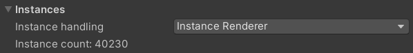

# MeshSyncServer

A component to sync meshes/models editing in DCC tools into Unity in real time.  
This sync process is done via TCP/IP, allowing developers to use DCC tools in different machines, and 
this connection can be configured in the server/port settings of 
the [MeshSync DCC Plugin](https://docs.unity3d.com/Packages/com.unity.meshsync.dcc-plugins@latest)
installed in the appropriate DCC tool.

## Properties

- **Auto Start**  

  |**Values** |**Description** |
  |:---       |:---|
  | On        | automatically start the server using the specified port.|
  | Off       | start/stop the server manually by clicking the **Start/Stop** button.|

  > Caveat: in a public network, other users will have access to MeshSync as well when the server is running. 
  > For example: they may view our Unity screen.

- **Asset Dir**  
  The local folder of the component where synced assets will be created. 

- **Root Object**  
  Designate a **GameObject** as the root for objects generated by the sync process.  
  If empty, the objects will be created in the root. 

- **Instance Handling**

  We can specify how Unity will create the instances of [a geometry node](GeometryNodes.md) (or its equivalent) using one of the following values: 

  |**Values** |**Description** |
  |:---       |:---|
  | **Instance renderer** | Create a MeshSync specific render component that batches the draw calls of each instance type. This is good for instances that do not need individual **GameObjects**.|
  | **Copies**            | Create a **GameObject** for each instance. This is slower than the instance renderer but gives more control over each object.|
  | **Prefabs**           | Create a prefab of the instanced object and places prefab instances in the scene. The prefab is saved in the **Asset Dir** property of the MeshSyncServer. Using prefabs for instances allows us to make changes to the instanced object, add custom components to it and apply that to all instances. |

  > Some caveats about the **Prefabs** mode: 
  > 1. Setting the mode to **Prefabs** will create a reference between the prefabs and by their original names in the DCC tools.
  >    If the name in the DCC tool changes, then MeshSync will consider it as a new object and will create a new prefab.
  > 2. Changes in the source objects in the DCC tool will not be applied to the prefabs automatically. 
  >    We can resync the prefabs by clicking the "Clear/resync prefabs" button if the DCC tool is open and and auto-sync has been enabled.

- **DCC asset file**

  We can assign a DCC asset file inside the Unity project to launch a new instance of the applicable DCC tool and 
  turn on **Auto-Sync** in the plugin automatically, provided that [MeshSyncDCCPlugins](https://docs.unity3d.com/Packages/com.unity.meshsync.dcc-plugins@latest) 
  has been installed in the DCC tool.
     
  The **Run mode** property specifies how to launch the DCC tool, and can be set with one of the following values:

  |**Values** |**Description** |
  |:---       |:---|
  | **GUI**          | Run the DCC tool in normal window mode.|
  | **Background**   | Run the DCC tool in headless mode without any window.|
  | **Console**      | Runs the DCC tool with the console window only. |
  

Please refer to [common properties](CommonMeshSyncProperties.md) for details on the other properties.

## Tips

When there is a MeshSyncServer object in the scene in Unity, we can:

- view Unity's Game view in the browser by typing MeshSyncServer's IP address and port in the URL box
  (the default is [127.0.0.1:8080](http://127.0.0.1:8080)).  

  

- send a message from a message form in the browser to Unity's console.

## Caveats

- Necessary MeshSync assets are automatically created in *StreamingAssets/MeshSyncServerRoot*.
  These files should be left as they are.

- Although this package is designed to be used in the Editor, model syncing will still work in runtime as well, 
  except for the animations.  
  **For performance reasons, make sure that syncing is not executed in the final build, unless it is required.**

