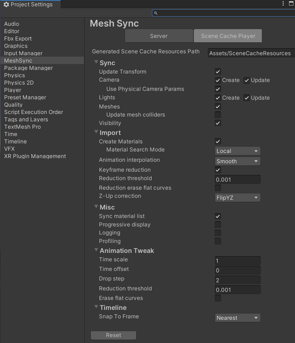

# Project Settings

1. [Server](#server)
1. [Scene Cache Player](#scene-cache-player)

## Server

Use the **Server** tab to set the default setting values for 
**MeshSyncServer** component.

|**Connection Settings**   |**Description** |
|:---                      |:---|
| **Server Port**          | The default server port.|
| **Allow public access**  | Allows public access to **MeshSyncServer**.   By default, this setting is turned off, and only computers in local network     (127.0.0.1, 10.0.0.0/24, 192.168.0.0/16 or 172.16.0.0 to 172.31.255.255) can connect to **MeshSyncServer**. |

Please refer to [MeshSyncServer](MeshSyncServer.md) 
or [Common MeshSync Properties](CommonMeshSyncProperties.md)'s documentations 
for more details on the other settings.

## Scene Cache Player

Use the **Scene Cache Player** tab to set the default setting values for 
**SceneCachePlayer** component.  
Please refer to [SceneCache](SceneCache.md) 
or [Common MeshSync Properties](CommonMeshSyncProperties.md)'s documentations    
for more details on these settings.

