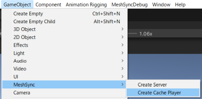

# Scene Cache

Scene Cache is a feature to playback all frames of an *.sc* file that 
was exported using [MeshSyncDCCPlugins](https://docs.unity3d.com/Packages/com.unity.meshsync.dcc-plugins@latest)
installed in a DCC Tool.   
This functionality is very similar to [AlembicForUnity](https://docs.unity3d.com/Packages/com.unity.formats.alembic@latest/index.html),
but it has the following differences:

1. Scene Cache is designed to playback frames precisely with high performance.
2. Scene Cache supports material export/import
3. Unlike Alembic, *.sc* files are only playable in Unity.

## How to use

From the menu, select **Game Object > MeshSync > Create Cache Player**, 
and then select the *.sc* file exported by the DCC tool.  
This will automatically create a GameObject with 
[SceneCachePlayer](#scene-cache-player) component, 
which will be played automatically in PlayMode.

Normally, the playback is controlled using an 
[*Animator*](https://docs.unity3d.com/ScriptReference/Animator.html) with an 
[*AnimationClip*](https://docs.unity3d.com/ScriptReference/AnimationClip.html), but 
we can also control the playback of [Scene Cache in Timeline](SceneCacheInTimeline.md).

## Scene Cache Player 

This component handles the playback of an *.sc* file. 

### Properties

- **Cache File Path**: the path to the *.sc* file.  
  Copying the cache file to StreamingAssets is recommended, and can be done by simply clicking the **Copy** button.  
 
  > Playing *.sc* files located in folders outside the active Unity project is supported, 
  > but keep in mind that only the computer which stores those *.sc* files can play them.

- **Time**: shows the playback time.  
  Editing this property will update the animation, and it will also be updated automatically by 
  AnimationClip or Timeline.  

- **Interpolation**  
  Smoothens animations by interpolating the meshes and transforms between neighboring frames.   
  Note that meshes are only interpolated if the topologies match (the vertex indexes remain unchanged).

SceneCache shares a lot of the same properties with MeshSyncServer.  
Please refer to [MeshSyncServer](MeshSyncServer.md)'s documentation for more details.

### Tips

* **Material List** property can be used to carry over existing materials when the cache file is updated.

