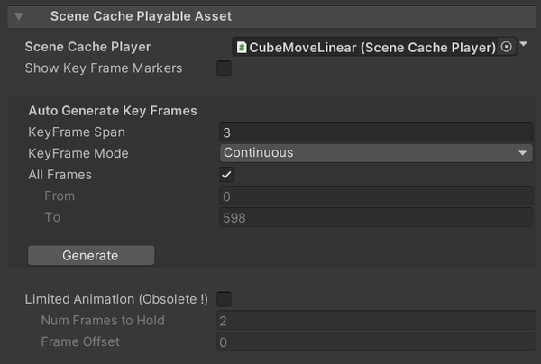

# Scene Cache In Timeline

[Scene Cache](SceneCache.md) can be controlled via 
[Timeline](https://docs.unity3d.com/Packages/com.unity.timeline@latest) 
by performing the following steps:

1. Open the Timeline window.
1. In the Timeline Window, click **Unity.MeshSync > Scene Cache Track** 
   to add a **SceneCacheTrack**.
1. Drag and drop the SceneCachePlayer **GameObject** to the newly added track, 
   which will automatically create a [SceneCachePlayableAsset](#scene-cache-playable-asset).

To view animation curves of SceneCache clips, click the **Curves** icon next to the Track name.

SceneCache **GameObjects** will be activated or deactivated automatically based on the following settings:
1. **Auto Activate Object** setting in the applicable [SceneCacheTrack](#scene-cache-track)
2. **Animation Extrapolation** settings in the applicable [SceneCachePlayableAsset](#scene-cache-playable-asset).
 
## Scene Cache Track

|**Properties**            |**Description** |
|:-----------------------  |:---|
| **Auto Activate Object** | Activate the SceneCachePlayer **GameObject** when the clip is active, and deactivate it otherwise. |

## Scene Cache Playable Asset

|**Properties**           |**Description** |
|:----------------------- |:---|
| **Scene Cache Player**  | The [SceneCachePlayer](SceneCache.md#scene-cache-player) to be played in Timeline. |
| **Snap To Frame**       | Sets if the playback time should snap to a frame and how. |

### Curve buttons

|**Buttons**          |**Description** |
|:--------------------|:---|
| **To Linear**       | Set the animation curve to a linear curve. |
| **Apply Original**  | Applies the original animation curve from the Scene Cache (.sc) file. |

