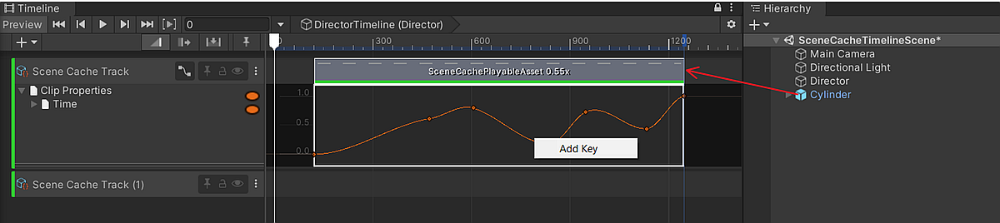
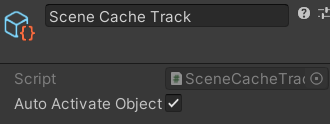

# Scene Cache In Timeline

1. [Quick Start](#quick-start)
1. [Scene Cache Track](#scene-cache-track)
1. [Gap Extrapolation](#gap-extrapolation)
1. [Scene Cache Playable Asset](#scenecacheplayableasset)

## Quick Start

[Scene Cache](SceneCache.md) can be controlled via 
[Timeline](https://docs.unity3d.com/Packages/com.unity.timeline@latest) 
by performing the following steps:

1. Open the Timeline window.
1. In the Timeline Window, click **Unity.MeshSync > Scene Cache Track** 
   to add a [SceneCacheTrack](#scene-cache-track).
1. Drag and drop the SceneCachePlayer **GameObject** to the newly added track, 
   which will automatically create a [SceneCachePlayableAsset](#scenecacheplayableasset).

To view animation curves of Scene Cache clips, click the **Curves** icon next to the Track name.
 
## Scene Cache Track

|**Properties**            |**Description** |
|:-----------------------  |:---|
| **Auto Activate Object** | Activate the SceneCachePlayer **GameObjects** of clips in the track when the clip is active, and deactivate it otherwise. |

## Gap Extrapolation

When **Auto Activate Object** setting in [SceneCacheTrack](#scene-cache-track) 
is turned off, then we can control the SceneCache playback in gaps 
before or after SceneCache clips in a similar way to 
[setting gap extrapolation for Animation clips](https://docs.unity3d.com/Packages/com.unity.timeline@1.7/manual/clp_gap_extrap.html)
using one of the following options:
1. **None** (default): undefined.
1. **Hold**: hold and show the first/last frame of the [Scene Cache](SceneCache.md) in the gap.
1. **Loop**: loop the [Scene Cache](SceneCache.md) with the same clip duration.
1. **Ping Pong**: loop the [Scene Cache](SceneCache.md) backwards, then forwards, and so forth, with the same clip duration.
1. **Continue**: undefined.

## SceneCachePlayableAsset

|**Properties**           |**Description** |
|:----------------------- |:---|
| **Scene Cache Player**  | The [SceneCachePlayer](SceneCache.md#scene-cache-player) to be played in Timeline. |
| **Limited Animation**   | Overrides the [Limited Animation](SceneCache.md#properties) properties of the SceneCachePlayer. |

### Curve buttons

|**Buttons**          |**Description** |
|:--------------------|:---|
| **To Linear**       | Set the animation curve to a linear curve. |
| **Apply Original**  | Applies the original animation curve from the Scene Cache (.sc) file. |

