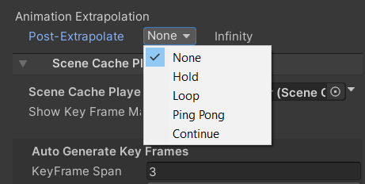
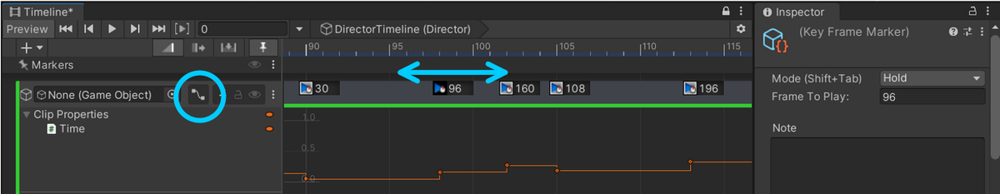
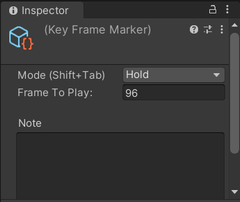

# Scene Cache In Timeline

1. [Quick Start](#quick-start)
1. [Scene Cache Track](#scene-cache-track)
1. [Gap Extrapolation](#gap-extrapolation)
1. [Scene Cache Playable Asset](#scenecacheplayableasset)
   1. [Key Frame Adjustment](#key-frame-adjustment)
   1. [Key Frame Properties](#key-frame-properties)
   1. [Default Key Frame Shortcuts](#default-key-frame-shortcuts)

## Quick Start

[Scene Cache](SceneCache.md) can be controlled via 
[Timeline](https://docs.unity3d.com/Packages/com.unity.timeline@latest) 
by performing the following steps:

1. Open the Timeline window.
1. In the Timeline Window, click **Unity.MeshSync > Scene Cache Track** 
   to add a [SceneCacheTrack](#scene-cache-track).
1. Drag and drop the SceneCachePlayer **GameObject** to the newly added track, 
   which will automatically create a [SceneCachePlayableAsset](#scenecacheplayableasset).

To view animation curves of Scene Cache clips, click the **Curves** icon next to the Track name.
 
## Scene Cache Track

|**Properties**            |**Description** |
|:-----------------------  |:---|
| **Auto Activate Object** | Activate the SceneCachePlayer **GameObjects** of clips in the track when the clip is active, and deactivate it otherwise. |

## Gap Extrapolation

When **Auto Activate Object** setting in [SceneCacheTrack](#scene-cache-track) 
is turned off, then we can control the SceneCache playback in gaps 
before or after SceneCache clips in a similar way to 
[setting gap extrapolation for Animation clips](https://docs.unity3d.com/Packages/com.unity.timeline@1.7/manual/clp_gap_extrap.html)
using one of the following options:
1. **None** (default): undefined.
1. **Hold**: hold and show the first/last frame of the [Scene Cache](SceneCache.md) in the gap.
1. **Loop**: loop the [Scene Cache](SceneCache.md) with the same clip duration.
1. **Ping Pong**: loop the [Scene Cache](SceneCache.md) backwards, then forwards, and so forth, with the same clip duration.
1. **Continue**: undefined.

## SceneCachePlayableAsset

|**Properties**           |**Description** |
|:----------------------- |:---|
| **Scene Cache Player**  | The [SceneCachePlayer](SceneCache.md#scene-cache-player) to be played in Timeline. |
| **Show Key Frame Markers**   | Shows/hides the key frame markers for editing the timing.   Refer to [Key Frame Adjustment](#key-frame-adjustment) for more details|
| **Auto Generate Key Frames** | A section to configure the key frames of the specified duration automatically. |
| **Limited Animation**        | Automatically skip frames if enabled. This property has been replaced by [Key Frame Adjustment](#key-frame-adjustment), and may be removed in later versions. |

### Key Frame Adjustment

We can modify the timing of the playback by the following steps:
1. Check the **Show Key Frame Markers** property.
2. Add, drag, or delete the key frame markers.
3. Set the properties of the key frames to configure which frame to show. Refer to [Key Frame Properties](#key-frame-properties) for more details.

Pressing the curve button next to the track name will open the curve section 
which allows us to confirm how the playback is being controlled by the clip.

Additionally, if we want to configure the key frames using a certain rule for a specified duration, 
we can use the **Auto Generate Key Frames** section to do this automatically. 

### Key Frame Properties

|**Properties**           |**Description** |
|:----------------------- |:---|
| **Mode**            | **Continuous**: interpolates **Frame To Play** linearly.   **Hold**: keep showing **Frame To Play** to create limited animation. |
| **Frame To Play**   | The frame of the *.sc* file to show at the timing of the marker. |
| **Note**            | User notes. |

### Default Key Frame Shortcuts

|**Shorcut Keys**     |**Description** |
|:----------------------- |:---|
| *Shift-Tab* | Change the mode of the selected key frame. |
| *Shift-E*   | Add a new key frame at the playhead location for the selected clip. |

