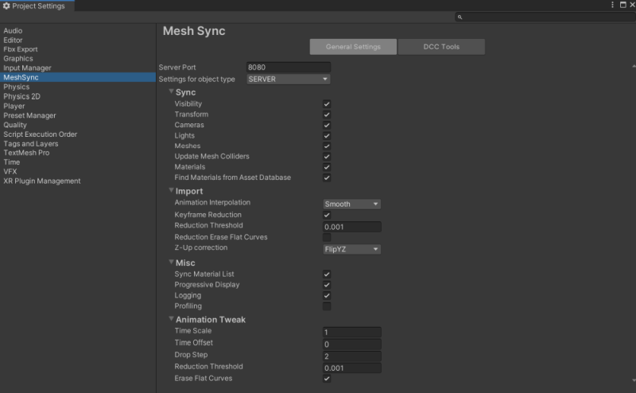
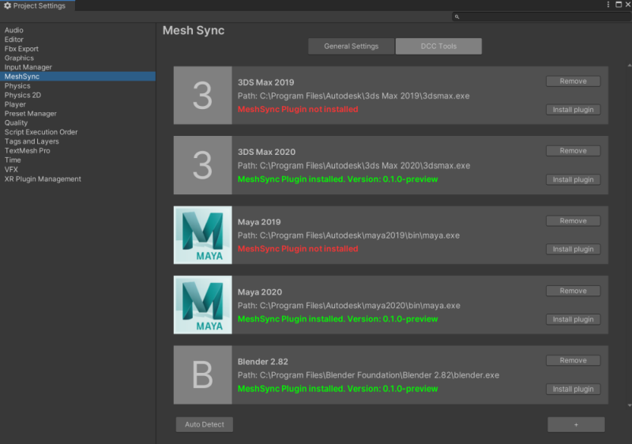

# Project Settings

1. [General Settings](#general-settings)
1. [DCC Tools](#dcc-tools)

## General Settings

Use the general settings tab to set the default property values of
MeshSync objects:
1. [MeshSyncServer](MeshSyncServer.md)
2. [SceneCache](SceneCache.md)

## DCC Tools

Use the DCC Tools tab to install 
[MeshSyncDCCPlugins](https://github.com/Unity-Technologies/MeshSyncDCCPlugins) 
in supported DCC Tools.  
When this tab is opened for the first time, 
it automatically detects DCC tools which have been 
installed in their default locations automatically and 
display them inside the tab.

| Legend  | Use                                                                                       | 
| ------- | ----------------------------------------------------------------------------------------- | 
| A       | The name of the DCC tool, its path, and its MeshSyncDCCPlugins installation status        |   
| B       | Click to remove the DCC tool from the tab                                                 |   
| C       | Click to install MeshSyncDCCPlugins in the DCC tool                                       |  
| D       | Click to detect and add DCC tools which have been installed in their default locations    |  
| E       | Click to add a DCC tool manually                                                          | 

### Supported DCC Tools

1. Maya 2017 - 2020
2. 3ds Max 2017 - 2020
3. Blender 2.79, 2.80, 2.81, 2.82

### Notes

1. Please close all instances of a DCC tool before installing MeshSyncDCCPlugins.
2. For some DCC tools, MeshSync plugin installation will launch the DCC tool automatically 
   to finalize the MeshSyncDCCPlugins installation process.

### MeshSyncDCCPlugins installation info

The installation info is stored in the following location.

| Operating System  | Path                                              | 
| ----------------- | --------------------------------------------------| 
| Linux             | ~/.config/unity3d/Unity/MeshSync                  |   
| macOS             | ~/Library/Application Support/Unity/MeshSync      |   
| Windows           | C:\Users\username\AppData\Local\Unity\MeshSync    |  

