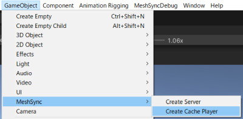

# Scene Cache
Scene Cache is a mechanism that saves every frame in the scene on the DCC tool side to a file and plays it back with Unity.  
The goal is to reproduce DCC models, cameras and animations precisely at high speed.

In that sense, SceneCache is very similar to Alembic. The biggest difference however, is the playback speed as SceneCache is several times faster than the Alembic playback with [AlembicForUnity](https://docs.unity3d.com/Packages/com.unity.formats.alembic@latest/index.html).  
In addition, SceneCache supports several elements which are not supported in Alembic, such as materials, and depending on the DCC tool, SceneCache may be able to reproduce scenes more precisely.  
(For Example: 3ds max's standard Alembic exporter does not support the export of meshes for rendering, but SceneCache supports it.)

On the downside, SceneCache sacrifices portability as the playback is only possible with Unity at the moment, and there is no guarantee of file compatibility among different Unity versions, so re-export may be required to use the same files with a different Unity version.

# How to use

From the menu, select Game Object-> MeshSync-> Create Cache Player, and then select the *.sc* file exported by the DCC tool.  
This will automatically create a playback object.

## Scene Cache Player

This component handles the playback. 
There are many settings which are in common with [MeshSyncServer](MeshSyncServer.md).

When "Create Cache Player" on the menu is selected, an AnimationClip, which also handles the animation Playback, will be created and tied to the SceneCachePlayer.  
We can place this clip on an AnimationTrack to play it in Timeline.

- **Cache File Path**  
Initially, the path to the *.sc* file is absolute, and therefore the animation can only be played on that PC.  
To copy or move the cache file to StreamingAssets, click the "Copy to StreamingAssets" or "Move to StreamingAssets" button.  
This will allow us to play the clips on the same project copied to another PC, or in a runtime executable.

- **Time**  
This is the playback time. We can play the animation by moving this parameter.
Usually this will be controlled by the AnimationClip.

- **Interpolation**  
Smooths animations by interpolating meshes and transforms from previous and subsequent frames.   
Mesh is only interpolated if the topologies match (the index remains unchanged).

