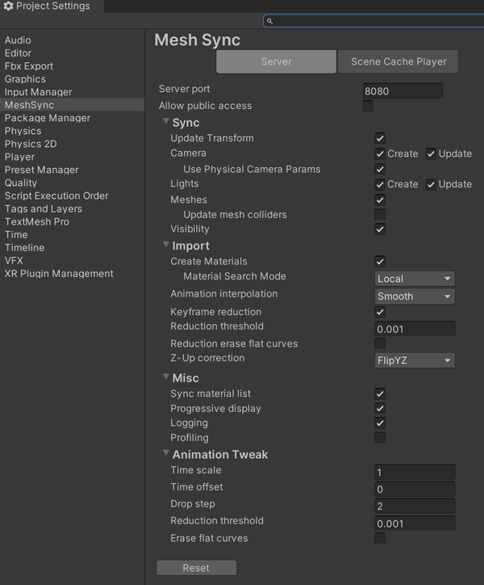

# MeshSync

Working together with [MeshSyncDCCPlugins](https://github.com/Unity-Technologies/MeshSyncDCCPlugins), MeshSync is a package for synchronizing meshes/models editing in DCC tools into Unity in real time.
This allows devs to immediately see how things will look in-game while modelling.  

## Supported Platforms

- Windows 64 bit
- Mac
- Linux

# Basic usage

From the **GameObject** menu, choose **MeshSync > Create Server** to create a server object.  
This object has [MeshSyncServer](en/MeshSyncServer.md) component that handles the sync process.

# Settings

Default settings for MeshSync components can be configured on the 
[Project Settings](en/ProjectSettings.md) window.

Similarly, DCC Tools integration can be configured on the 
[Preferences](en/Preferences.md) window

# Advanced Features
- [SceneCache](en/SceneCache.md)
  - [SceneCache in Timeline](en/SceneCacheInTimeline.md)

# Other Languages
- [日本語](jp/index.md)

