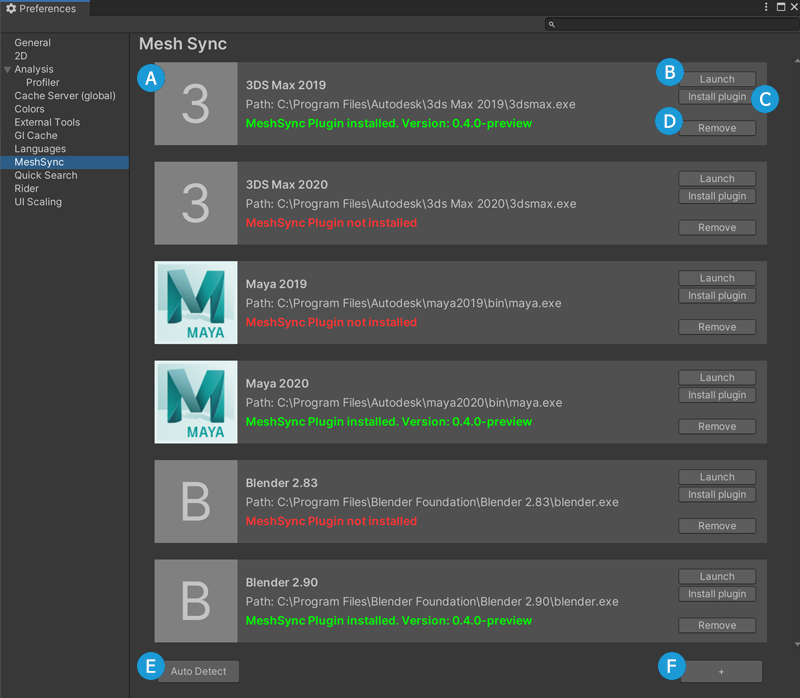

# 環境設定

環境設定ウィンドウで、サポートされている DCC ツールに
[MeshSyncDCCPlugins](https://github.com/Unity-Technologies/MeshSyncDCCPlugins) 
をインストールできます。 
初めてこのウィンドウが開かれた時、デフォルトパスにインストールされた DCC ツールが自動的に
検出され、ウィンドウに表示されます。

| 記号    | 用途                                                                                       | 
| ------- | ----------------------------------------------------------------------------------------- | 
| A       | DCC ツールの名前、パス、とその MeshSyncDCCPlugins のインストール状況を表示する                 |   
| B       | DCC ツールを起動する                                                                       |   
| C       | DCC ツール に MeshSyncDCCPlugins をインストールする                                         |  
| D       | ウィンドウから DCC ツールを削除する                                                          |   
| E       | デフォルトパスにインストールされた DCC ツールを検出し、タブに表示する                           |  
| F       | 手動で DCC ツールを追加する                                                                 | 

### サポートされている DCC ツール

1. Maya 2017 - 2020
2. 3ds Max 2017 - 2020
3. Blender 2.79, 2.80, 2.81, 2.82, 2.83, 2.90, 2.91

### 注意

1. MeshSyncDCCPlugins をインストールする前に、DCC ツールのインスタンスを終了してください。
2. 一部の DCC ツールで、MeshSyncDCCPlugins のインストールを完了させるために、
   その DCC ツールが起動される場合があります。

### MeshSyncDCCPlugins のインストール状況

インストール状況は下記のパスで保存されます。

| OS                | パス                                              | 
| ----------------- | --------------------------------------------------| 
| Linux             | ~/.config/unity3d/Unity/MeshSync                  |   
| macOS             | ~/Library/Application Support/Unity/MeshSync      |   
| Windows           | C:\Users\username\AppData\Local\Unity\MeshSync    |  

