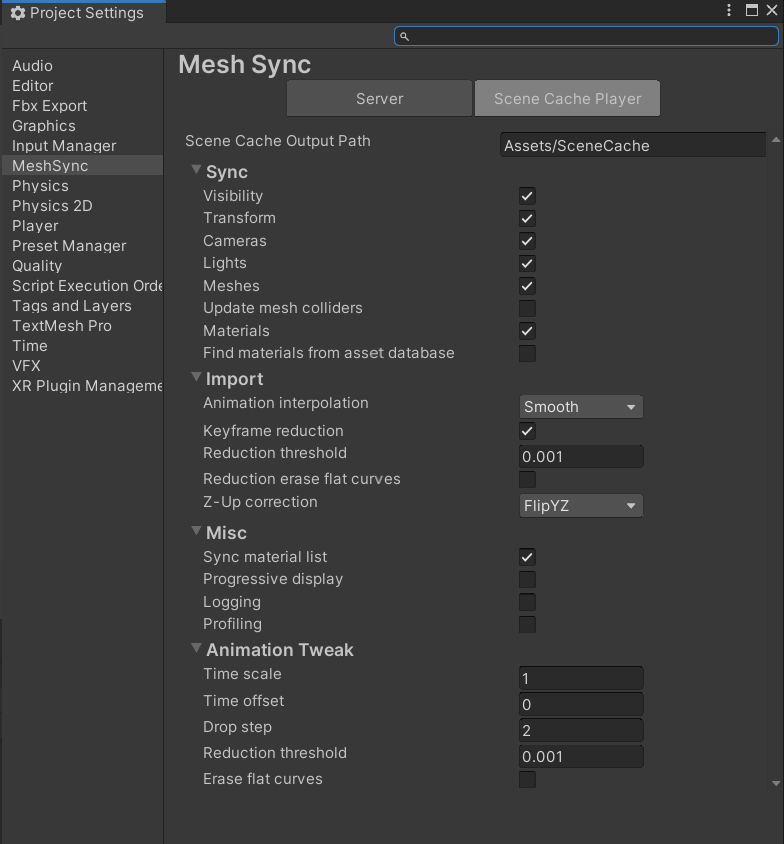

# プロジェクト設定

1. [Server](#server)
1. [Scene Cache Player](#scene-cache-player)

## Server

**Server** タブで、[MeshSyncServer](MeshSyncServer.md) コンポネントのデフォルト設定と接続設定を設定できます：
   * **Server Port**  
     デフォルトのサーバーのポート。
   * **Allow public access**  
     パブリック IP から MeshSync へのアクセスを許可する。 通常、この設定はオフになっており、
     ローカルネットワーク (127.0.0.1, 10.0.0.0/24, 192.168.0.0/16 or 172.16.0.0 to 172.31.255.255)
     にある端末のみ、MeshSync へアクセスできます。     

## Scene Cache Player

**SceneCache** タブで、[SceneCache](SceneCache.md) コンポネントのデフォルト設定を設定できます。

