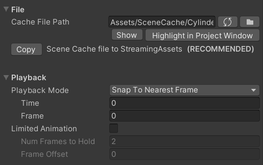

# Scene Cache
Scene Cache は DCC 上のシーンを各フレームそのままファイルに保存しておき、Unity で再生する仕組みです。  
DCC 側のモデル、カメラ、アニメーションを忠実に、かつ高速に再生することを目的としています。  

非常に近いものとして Alembic が挙げられます。Alembic との最大の違いは再生速度です。[AlembicForUnity](https://docs.unity3d.com/Packages/com.unity.formats.alembic@latest/index.html) で Alembic 再生するよりも SceneCache の方が数倍速くなります。  
他にはマテリアルのサポートなど Alembic にはない要素が追加されていたり、DCC ツールによっては SceneCache の方が再現度が高いこともあります。  
(例：3ds max の標準の Alembic exporter はレンダリング用 Mesh のエクスポートはサポートしていませんが、SceneCache は可能です)  

代償として、現状 Unity でしか再生できない、バージョンアップで互換性が失われて再エクスポートが必要になる可能性が高い等、汎用性をほぼ捨てているという欠点もあります。

#使い方

Game Object -> MeshSync -> Create Cache Player メニューを選択し、DCC 側でエクスポートした *.sc* ファイルを選択し、再生用オブジェクトを作成します。

## Scene Cache Player
このコンポーネントが再生を担当します。多くの設定は [MeshSyncServer](index.md#MeshSyncServer) と共通です。

"Create Cache Player" メニューを選択した時、同時に アニメーションの再生を担当する AnimationClip が作成されて SceneCachePlayer に結び付いています。  
Timeline で再生する場合も、この clip を AnimationTrack に配置することで対応できます。

- **Cache File Path**  
初期時に、 *.sc* ファイルへのパスが絶対パスになっており、その PC でしか再生できません。  
"Copy to StreamingAssets" 、又は "Move to StreamingAssets" ボタンを押すと、キャッシュファイルを StreamingAssets にコピー、又は移動します。  
これを行っておくと、プロジェクトを他の PC にコピーした場合や、プロジェクトをビルドして他の PC で動かした場合も再生できるようになります。

- **Time**  
再生の時間です。
このパラメータを動かすことでアニメーションを再生します。
通常これは AnimationClip で制御することになるでしょう。

- **Interpolation**  
前後のフレームの Mesh や Transform を補間してアニメーションを滑らかにします。  
Mesh はトポロジが一致している (インデックスが不変) もののみ補間されます。
