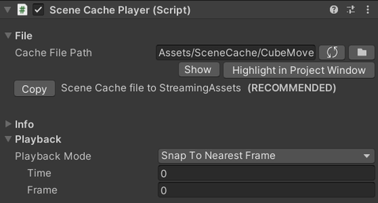

# Scene Cache

Scene Cache は、DCC ツールにインストールされた
[MeshSyncDCCPlugins](https://github.com/Unity-Technologies/MeshSyncDCCPlugins)
を使ってエクスポートされた *.sc* ファイルの全フレームを再生するための機能です。  
この機能は [AlembicForUnity](https://docs.unity3d.com/Packages/com.unity.formats.alembic@latest/index.html)
と非常によく似ていますが、下記の違いがあります：

1. Scene Cache は、全フレームを正確にかつ高速に再生するように設計されています。
1. Scene Cache はマテリアルのエクスポート・インポートをサポートします。
1. Alembic とは異なり、*.sc* ファイルは Unity でのみ再生できます。

# 使い方

**Game Object > MeshSync > Create Cache Player** メニューを選択し、
DCC 側でエクスポートした *.sc* ファイルを選択します。
これによって、[SceneCachePlayer](#scene-cache-player)
コンポネントが入っている GameObject が生成され、PlayMode の時に自動的に再生されます。

通常、Scene Cache の再生は 
[*Animator*](https://docs.unity3d.com/ScriptReference/Animator.html) と
[*AnimationClip*](https://docs.unity3d.com/ScriptReference/AnimationClip.html)
で制御されていますが、[タイムライン上](SceneCacheInTimeline.md)でも再生を制御することができます。

### Timeline 経由で再生

下記の手順を行うことで、
[Timeline](https://docs.unity3d.com/ja/Packages/com.unity.timeline@1.5/manual/index.html) 
経由で Scene Cache の再生を制御することができます。

1. Timeline ウィンドウを開きます。
1. Timeline ウィンドウで **Unity.MeshSync > Scene Cache Track** をクリックし、
   **SceneCacheTrack** を追加します。
1. SceneCachePlayer の GameObject を新しく追加されたトラックにドラッグアンドドロップします。

## Scene Cache Player

このコンポーネントが再生を担当します。多くの設定は [MeshSyncServer](MeshSyncServer.md) と共通です。

- **Cache File Path**  
初期時に、 *.sc* ファイルへのパスが絶対パスになっており、その PC でしか再生できません。  
キャッシュファイルを StreamingAssets にコピーすることを推奨しており、
"Copy" ボタンで簡単にコピーすることができます。  
これを行っておくと、プロジェクトを他の PC にコピーした場合や、プロジェクトをビルドして他の PC で動かした場合も再生できるようになります。

- **Time**  
再生の時間です。
このパラメータを動かすことでアニメーションを再生します。
通常これは AnimationClip で制御することになるでしょう。

- **Interpolation**  
前後のフレームの Mesh や Transform を補間してアニメーションを滑らかにします。  
Mesh はトポロジが一致している (インデックスが不変) もののみ補間されます。
