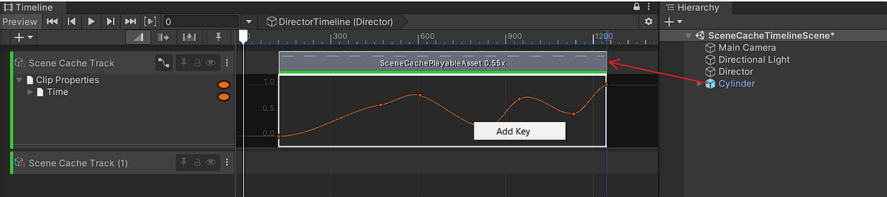
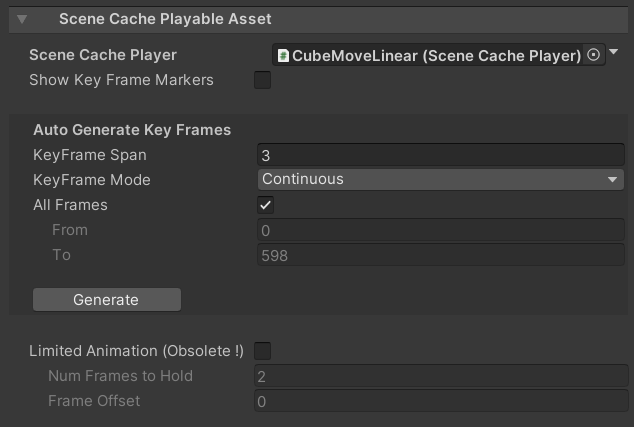

# タイムライン上の SceneCache

下記の手順を行うことで、
[Timeline](https://docs.unity3d.com/ja/Packages/com.unity.timeline@1.5/manual/index.html) 
経由で [Scene Cache](SceneCache.md) の再生を制御することができます。

1. Timeline ウィンドウを開きます。
1. Timeline ウィンドウで **Unity.MeshSync > Scene Cache Track** をクリックし、
   **SceneCacheTrack** を追加します。
1. SceneCachePlayer の GameObject を新しく追加されたトラックにドラッグアンドドロップします。
   これにより、[SceneCachePlayableAsset](#scene-cache-playable-asset) 
   が自動的に生成されます。

トラック名の横にあるカーブアイコンをクリックすれば、
クリップのアニメーションカーブが表示されます。

## Scene Cache Playable Asset

- **Scene Cache Player:**  
タイムライン上で再生される [SceneCachePlayer](SceneCache.md#scene-cache-player)。

- **Curves**  
  - **To Linear:** アニメーションのカーブを線形曲線に設定する。
  - **Apply Original:** SceneCache (*.sc*) ファイルからの元のアニメーションカーブを適用する。

