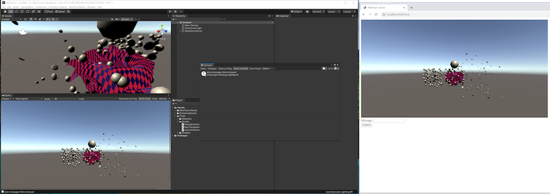

# MeshSync

[MeshSyncDCCPlugin](https://github.com/Unity-Technologies/MeshSyncDCCPlugin) と一緒に動作するで、
MeshSync は DCC ツール上のモデルの編集をリアルタイムに Unity に反映させるパッケージです。  
ゲーム上でどう見えるかをその場で確認しながらモデリングすることを可能にします。

## 動作環境

- Windows 64 bit
- Mac
- Linux

# 基本的な使い方

メニューから GameObject -> MeshSync -> Create Server でサーバーオブジェクトを作成します。このサーバーオブジェクトが同期処理を担当する MeshSyncServer のコンポーネントを持っています。

## MeshSyncServer

- **Auto Start**  
  On: 特定のポートで、自動的にサーバーを起動する。  
  Off: サーバーを起動、又は止めるため、手動的に **Start/Stop** をクリックする。

  > 注意：パブリックネットワークで、サーバーが起動した状態では、他のユーザーも MeshSync にアクセスすることができてしまう。例えば、Unity のスクリーンを見ることができるなど。

- **Root Object**  
同期により生成されるオブジェクト群のルートとなるオブジェクトを指定します。
未設定の場合、ルートにオブジェクトが生成されていきます。

- **Sync Visibility, Sync Transform など**  
コンポーネント別の同期の有効/無効指定です。Play モードで物理シミュレーションの挙動を確認したい場合などに Transform の同期が邪魔になるので用意されたオプションです。

  - **Update Mesh Colliders** が有効の場合、オブジェクトが MeshCollider を持っていたら Mesh を更新する時に MeshCollider の内容も更新します。
  
- **Animation Interpolation**  
アニメーションの補完方法を指定します。
 多くの場合デフォルトのスムース補間で問題ないと思われますが、フレーム単位で一致させたい場合などは補間が無効 "Constant" の方が望ましいと思われます。
 
- **Keyframe Reduction**  
有効な場合、アニメーションをインポートする際にキーフレームリダクションを行います。  
  - **Threshold**: は誤差の許容量です。  
  大きいほどキーの数は減りますが、元のアニメーションとの誤差が大きくなります。  
  - **Erase Flat Curves**: 最初から最後まで変化がないカーブを削除します。
  
- **Z-Up Correction**  
座標系が Z-Up である 3ds max と Blender のみ関係がある設定で、Z-Up を Y-Up に変換する方法を指定します。  
"Flip YZ" は全 Transform と Mesh の頂点を Y-up に直します。  
"Rotate X" はルートとなるオブジェクトの Transform に -90 の X 回転をかけることで Y-up に直すもので、Mesh は Z-up のままになります。  

多くの場合 "Flip YZ" の方が望ましいと思われますが、Unity 標準の fbx Importer が "Rotate X" 相当の処理を行っているため、選べるようにしてあります。

- **Material List**  
MeshSyncServer や [SceneCachePlayer](SceneCache.md)  はマテリアルのリストを保持しています。このリストのマテリアルを変更すると、対応するオブジェクトにも変更が反映されます。
  - **Sync Material List** が有効な場合、オブジェクトのマテリアルを変更した際にそれをマテリアルリストにも反映し、同じマテリアルを持つ他のオブジェクトにも変更を伝播します。
  - **Import List, Export List** でリストの保存と読み込みができます。  
  キャッシュファイルを更新する場合、これを用いることでマテリアルを引き継ぐことができます。

- **Progressive Display**  
オン：受信途中のシーンの更新をリアルタイムで反映していきます。  
オフ：シーン全体のデータの受信が完了するまで待ってから更新を反映します。

- **Animation Tweak**  
基本的なアニメーションの調整がここで可能です。
  - **Override Frame Rate**: フレームレートを変更します。  
  Unity 標準の "Set Sample Rate" と異なり、変更するのは純粋にフレームレートだけで、キーの時間やアニメーションの長さは変えません。補間がない 24 FPS のアニメーションを 60 FPS の環境で再生するとガタガタになってしまうので、そのような場合に無理矢理アニメーションを 120 FPS などに変えて緩和する、というような用途を想定しています。
  - **Time Scale**: 時間のスケーリングを行います。  
  例えば 0.5 を適用すると倍速になります。  
      - **Offset** は指定秒分オフセットを加えます。  
      例えば 5 秒のアニメーションに対して スケール -1、オフセット -5 を適用すると逆再生になります。
  - **Drop Keyframe** はフレームの間引きを行います。  
  30 個のキーが打たれているアニメーションに **Step=2** で適用すると奇数フレームを間引き、15 フレームのアニメーションになります。  
  同様に **Step=3** だと 10 フレームになります。

- **アセット化**  
DCC ツール側の編集によって生成された Mesh 郡は、そのままではそのシーン内にしか存在できないオブジェクトです。他のシーンやプロジェクトへ持ち出せるようにするにはアセットファイルとして保存する必要があります。
MeshSyncServer の "Export Mesh" ボタンを押すとそのアセット化が行われます。("Asset Export Path" で指定されたディレクトリにファイルが生成されます)  

# アドバンスト 機能
- [SceneCache](SceneCache.md)

# Tips 

- Unity 2019.1 で最大 255 ボーンまで影響できるようになりました。  
これにより、フェイシャルなどの多数のボーンを必要とするアニメーションも問題なく持って来れるはずです。
詳しくは, [Quality Settings-Blend Weights](https://docs.unity3d.com/ja/current/Manual/class-QualitySettings.html) をご参照ください。

- 同期は TCP/IP を介して行われるため、Unity と DCC ツールが別のマシンで動いていても同期させることができます。  
その場合、クライアントである DCC ツール側は設定項目の Server / Port に Unity 側のマシンを指定してください。

- Unity 上に MeshSyncServer オブジェクトがあるときにサーバーのアドレス:ポートをブラウザで開くと、サーバー側の Unity の GameView をブラウザで見ることができます。 (デフォルトでは [127.0.0.1:8080](http://127.0.0.1:8080))  
  このブラウザの画面のメッセージフォームからメッセージを送ると、Unity の Console にそのメッセージが出るようになっています。  
  Unity 側作業者と DCC 側作業者が別の場合役に立つこともあるかもしれません。
  
  
  
- ポーズ/アニメーションのみを編集中の場合、**Sync Meshes** を切っておくことをおすすめします。  
メッシュデータを送らなくなるので動作が軽快になるでしょう。

# 注意事項
- MeshSyncServer が起動された時に、*StreamingAssets/MeshSyncServerRoot* の下に必要な MeshSync のアセットが自動的にコピーされます。  
  これをそのままにして下さい。 

- 本パッケージはその性質上エディタでのみの使用を想定していますが、一応
ランタイムでもモデルの同期は一通り動作します。アニメーションの同期は機能しません。  
**意図せず最終ビルドに残さないようご注意ください。**

- Unity 2019.1 より前のバージョンでは、このパッケージを使えますが、頂点あたりの最大影響ボーン数が 4 であることに注意が必要です。  
これが原因でボーンが多いと DCC 側と Unity 側で結果が一致しなくなることがあります。

# 他の言語
- [English](../index.md)

