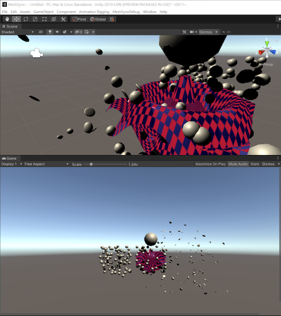

# Building on Windows

## Prerequisites (Win)

1. Install [cmake](https://cmake.org/) 
1. Install Visual Studio 2017
1. Install git. For example: [SourceTree](https://www.sourcetreeapp.com/)
1. Download and build [Poco](https://pocoproject.org) (static libraries).  
    ``` 
    $ git clone -b master https://github.com/pocoproject/poco.git
    $ mkdir cmake-build
    $ cd cmake-build
    $ cmake .. -DBUILD_SHARED_LIBS=OFF -G "Visual Studio 15 2017" -A x64
    $ cmake --build . --config MinSizeRel && cmake --build . --config Debug
    ```
    > For other types of Poco configurations, see [Poco's Getting Started](https://pocoproject.org/docs/00200-GettingStarted.html).
1. Add *Poco_DIR* environment variable to point to the Poco root folder above
1. Build [zstd](https://github.com/facebook/zstd/releases)  
   * Download and extract one of the releases in a folder
   * Start "Developer Command Prompt for VS 2017" and go to where zstd was extracted
   * Execute the following in the command prompt      
    ``` 
    $ cd build\VS2010
    $ devenv zstd.sln /upgrade
    $ msbuild zstd.sln /p:Configuration=Release /p:Platform=x64
    ```


## Build Steps (Win)


Start "Developer Command Prompt for VS 2017" and execute the following:

    ``` 
    $ git clone https://github.com/unity3d-jp/MeshSync
    $ cd MeshSync~\Plugin~\Build
    $ cmake -G "Visual Studio 15 2017" -A x64 ..
    $ msbuild MeshSyncPlugin.sln /t:Build /p:Configuration=MinSizeRel /p:Platform=x64 /m /nologo
    ```  

This release build is linked against Poco's release libraries with the following configurations, whichever is found first:  

1. MinSizeRel  
1. Release  
1. RelWithDebInfo 

> For a regular "Command Prompt", there is a script: *VsDevCmd_2017.bat* 
> under the *Build* folder, which if executed, will turn the prompt into a 
> "Developer Command Prompt for VS 2017".

# Building on Mac OSX

## Prerequisites (Mac)

1. Install [cmake](https://cmake.org/) 
1. Install [XCode](https://developer.apple.com/xcode/)
1. Install [Homebrew](https://brew.sh/)
1. Install git. For example: [SourceTree](https://www.sourcetreeapp.com/)
1. Download and build the debug and release versions of [Poco](https://pocoproject.org) (static libraries).  
    ``` 
    $ git clone -b master https://github.com/pocoproject/poco.git
    $ mkdir cmake-build
    $ cd cmake-build
    $ cmake .. -DBUILD_SHARED_LIBS=OFF -DCMAKE_BUILD_TYPE=MinSizeRel && cmake --build . 
    $ cmake .. -DBUILD_SHARED_LIBS=OFF -DCMAKE_BUILD_TYPE=Debug && cmake --build . 
    ```
    > For other types of Poco configurations, see [Poco's Getting Started](https://pocoproject.org/docs/00200-GettingStarted.html).
1. Add *Poco_DIR* environment variable to point to the Poco root folder above. For example:  
    ``` 
    export Poco_DIR=~/MySDK/poco
    ```  
    It might also be good to add this command to *~/.bash_profile*
1. Install [zstd](https://github.com/facebook/zstd/releases)  via Homebrew  
    ``` 
    $ brew install zstd
    ```  


## Build Steps (Mac)

Open a terminal and execute the following

``` 
$ git clone https://github.com/unity3d-jp/MeshSync
$ cd MeshSync/Plugin~/Build
$ cmake -GXcode ..
$ xcodebuild -scheme mscore -configuration MinSizeRel build
```


# Tips

There is a test project that can be created by specifying `-DBUILD_TESTS=ON`.

1. Windows  
    ``` 
    $ cmake -G "Visual Studio 15 2017" -A x64 .. -DBUILD_TESTS=ON
    ```
2. Mac  
    ``` 
    $ cmake -GXcode .. -DBUILD_TESTS=ON
    ```

When this project is executed, it will send data to 
[MeshSyncServer](../../../Readme.md#MeshSyncServer) in Unity.




