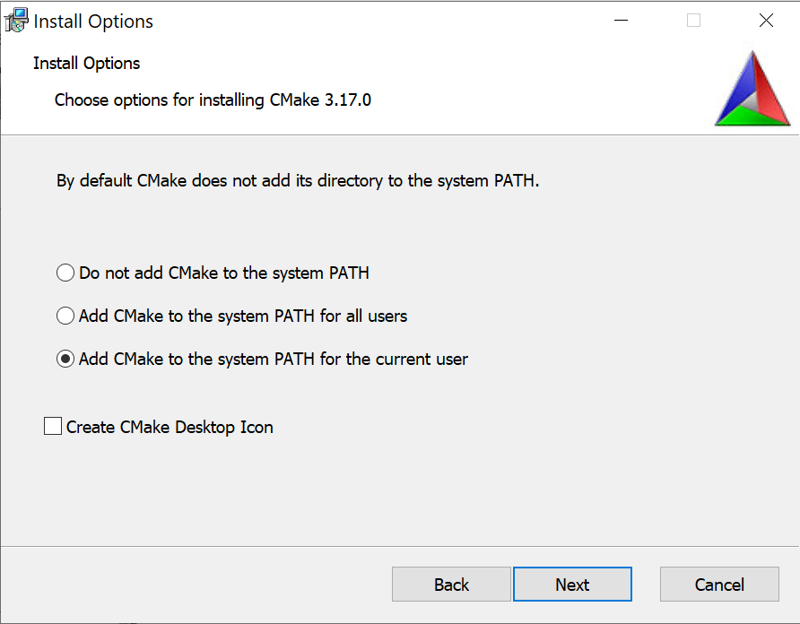

# Building Plugins

1. [Windows](#building-on-windows)
1. [Mac OSX](#building-on-mac_osx)
1. [Tips](#tips)

## Building on Windows


### Prerequisites (Win)

1. Install [cmake](https://cmake.org/)   
   Make sure to choose one of the "Add CMake to the System PATH ..." options as shown below.
   
1. Install Visual Studio 2017
1. Install git. For example: [SourceTree](https://www.sourcetreeapp.com/)
1. Build [Poco](https://pocoproject.org) (static libraries).  
   * Download [Poco 1.10.1](https://github.com/pocoproject/poco/archive/poco-1.10.1-release.zip) and extract the file in a folder
   * Start "Developer Command Prompt for VS 2017" and go to where Poco was extracted
   * Execute the following in the command prompt      
    ``` 
    $ mkdir cmake-build
    $ cd cmake-build
    $ cmake .. -DBUILD_SHARED_LIBS=OFF -G "Visual Studio 15 2017" -A x64
    $ cmake --build . --config MinSizeRel && cmake --build . --config Debug
    ```
    
    > To build Poco libraries with other configurations, see [Poco's Getting Started](https://pocoproject.org/docs/00200-GettingStarted.html).

1. Add *Poco_DIR* environment variable to point to the Poco root folder above
    

### Build Steps (Win)


Start "Developer Command Prompt for VS 2017" and execute the following:

    ``` 
    $ git clone https://github.com/unity3d-jp/MeshSync
    $ cd MeshSync\Plugin~\Build
    $ cmake -G "Visual Studio 15 2017" -A x64 ..
    $ msbuild MeshSyncPlugin.sln /t:Build /p:Configuration=MinSizeRel /p:Platform=x64 /m /nologo
    ```  

> For a regular "Command Prompt", there is a script: *VsDevCmd_2017.bat* 
> under the *Build* folder, which if executed, will turn the prompt into a 
> "Developer Command Prompt for VS 2017".


### Notes

The build process will try to link againts Poco's release libraries in the following order:  
1. MinSizeRel  
1. Release  
1. RelWithDebInfo 

The build process is using [zstd v1.4.4](https://github.com/facebook/zstd/releases/download/v1.4.4/zstd-v1.4.4-win64.zip) 
which has already been put inside the [External](../../External/zstd) folder for convenience.

## Building on Mac OSX

### Prerequisites (Mac)

1. Install [cmake](https://cmake.org/) 
1. Install [XCode](https://developer.apple.com/xcode/)
1. Install XCode Command Line tools  
    ``` 
    xcode-select --install
    ```  
1. Install [Homebrew](https://brew.sh/)
1. Install git. For example: [SourceTree](https://www.sourcetreeapp.com/)
1. Build [Poco](https://pocoproject.org) (static libraries).  
   * Download [Poco 1.10.1](https://github.com/pocoproject/poco/archive/poco-1.10.1-release.zip) and extract the file in a folder
   * Open a terminal and go to where Poco was extracted
   * Execute the following in the command prompt      
    ``` 
    $ mkdir cmake-build
    $ cd cmake-build
    $ cmake .. -DBUILD_SHARED_LIBS=OFF -DCMAKE_BUILD_TYPE=MinSizeRel && cmake --build . 
    $ cmake .. -DBUILD_SHARED_LIBS=OFF -DCMAKE_BUILD_TYPE=Debug && cmake --build . 
    ```
    > For other types of Poco configurations, see [Poco's Getting Started](https://pocoproject.org/docs/00200-GettingStarted.html).
    
1. Add *Poco_DIR* environment variable to point to the Poco root folder above. For example:  
    ``` 
    export Poco_DIR=~/MySDK/poco
    ```  
    It might also be good to add this command to *~/.bash_profile*
1. Install the following via Homebrew  
    ``` 
    $ brew install zstd
    $ brew install tbb
    ```  
    
    Currently, the used version of each is:
    * zstd: `stable 1.4.4`.
    * tbb:  `stable 2020_U1`.


### Build Steps (Mac)

Open a terminal and execute the following

``` 
$ git clone https://github.com/unity3d-jp/MeshSync
$ cd MeshSync/Plugin~/Build
$ cmake -GXcode ..
$ xcodebuild -scheme mscore -configuration MinSizeRel build
```


## Tips

There is a test project that can be created by specifying `-DBUILD_TESTS=ON`.

1. Windows  
    ``` 
    $ cmake -G "Visual Studio 15 2017" -A x64 .. -DBUILD_TESTS=ON
    ```
2. Mac  
    ``` 
    $ cmake -GXcode .. -DBUILD_TESTS=ON
    ```

When this project is executed, it will send data to 
[MeshSyncServer](../../../Readme.md#MeshSyncServer) in Unity.


