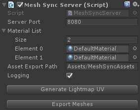

# MeshSync
[English](https://translate.google.com/translate?sl=ja&tl=en&u=https://github.com/unity3d-jp/MeshSync/) (by Google Translate)

This is a tool that allows you to reflect models edited with the modeling tool Metasequoia in real-time in Unity. Now you can model while checking how that model will look in your game.  
You can also import scenes made in Unity directly to Metasequoia. This tool can help you when you want to check how your design will look in-game, or use Unity to supplement your modeling.

This tool functions as a plugin for Unity and Metasequoia.
It is compatible with Unity 5.4 and above (64-bit Windows) and Metasequoia versions 3 and 4.5.6 and above (32 and 64-bit Windows).

## How to Use
- In Unity
 - Import [this package](https://github.com/unity3d-jp/MeshSync/releases/download/0.7.5/MeshSync.unitypackage) to your project.
 - Create a server object by going to the menu and selecting GameObject, then MeshSync, and Create Server.
 - This server object will take care of syncing. You cannot sync without this in the scene.
- In Metasequoia
 - Install [this plugin](https://github.com/unity3d-jp/MeshSync/releases/download/0.7.5/UnityMeshSync.for.Metasequoia.zip). The plugin type is STATION.
 Open Unity Mesh Sync from the panel, and select Auto Sync.
 Edits are automatically reflected in Unity while Auto Sync is enabled. You can manually reflect edits by pressing the Manual Sync button, even if Auto Sync is disabled.
  - Press Import Unity Scene to import the scene you currently have open in Unity.

## Explanation for Metasequoia

You can sync even if you have two separate machines running Metasequoia and Unity, because the sync is performed through TCP/IP. You will need to configure the Metasequoia client to do this. Set Server : Port in the Unity Mesh Sync panel to a remote machine address.

### Supported and Non-Supported Features
- Mirroring and smoothing are also reflected in Unity.
 - However, "Joined" mirroring option is not supported.
- Objects not shown in Metasequoia do not show in Unity either. Objects that are not showing cannot transmit mesh content, so if objects in a scene increase and syncing is heavy, you can speed it up by not displaying the objects.
- Materials are not reflected in Unity, but a sub-Mesh properly partitions them according to the material ID.
- Subdivisions and blob are not reflected in Unity until they freeze.
- Bones are not currently supported.
- There are also some limits to editing a Skinned Mesh in a scene imported from Unity. You cannot edit the weight or make changes to the topology. The tool can only reflect the movement of vertices and edits to normal vectors (explained below).

### Transcribing Normal Vectors
 Only normal vectors are transcribed in Unity when an object in Metasequoia with “:normal” in the name is recognized as an object for transcribing normal vectors.  
 For example, if you have objects named “Hoge” and “Hoge:normal” in Metasequoia, only “Hoge” will be generated in Unity, and its normal vectors will become a part of “Hoge:normal” in Metasequoia.  
 For Objects for normal vectors, the corresponding objects and the topology need to be the same (there needs to be an equal number of vertices and indices). Otherwise, they will be ignored.  
! [normal editing](doc/normal_editing.png)

## Explanation for Unity

### Material List
MeshSyncServer maintains the material list.
This list corresponds to the material list in Metasequoia. You can properly assign materials to the corresponding object by configuring them in this list.

### Making Assets
Mesh groups generated by editing in Metasequoia are objects that can only exist within that scene if unchanged. You need to save them as an asset file to be able to bring them to other scenes and objects. You can turn these Mesh groups into assets by pressing the Export Mesh button in MeshSyncServer (file will be created in the directory specified in Asset Export Path).  
Also, if you edit a model imported to Metasequoia from Unity, nothing will be changed in the original Unity Mesh for stability purposes. Instead, a new Mesh will be created to show the edits. Export Mesh also reflects the changes in the original asset in this case.

### Lightmap UV
This plugin uses a dedicated UV that differs from a typical one if you use a Lightmap in Unity.
A typical UV is automatically generated when importing a model, but in this plugin, that does not happen with models received from Metasequoia.  
Generate the proper Lightmap UV by pressing the Generate Lightmap UV button in MeshSyncServer.
Please be aware that this process can take quite some time.

### Runtime Support
This plugin is only intended for use in editors with those properties. Unintentionally leaving it in the final build may result in some unexpected behaviors. That means **errors will occur if you build in Standalone**.  
If you wish to keep it in your final build, comment out in ErrorOnStandaloneBuild() in MeshSyncServer.cs. This will generally work in runtime, except for when you cannot construct a material list.

## Other Points
- Syncing takes place in a heavy workload that sends all Mesh content through TCP/IP.  
- The conversion process for Meshes occurs in almost all servers (Unity), so you can complete the process by simply sending the Mesh from the tool. This means it might not be much more difficult to add support for tools other than Metasequoia. I think we will add support for more tools in the future.  
- If you wish to build this plugin from source, you should be able to do so by cloning this repository, opening Plugin/MeshSync.sln in Visual Studio 2015, and building.  

## License
[MIT](LICENSE.txt)
