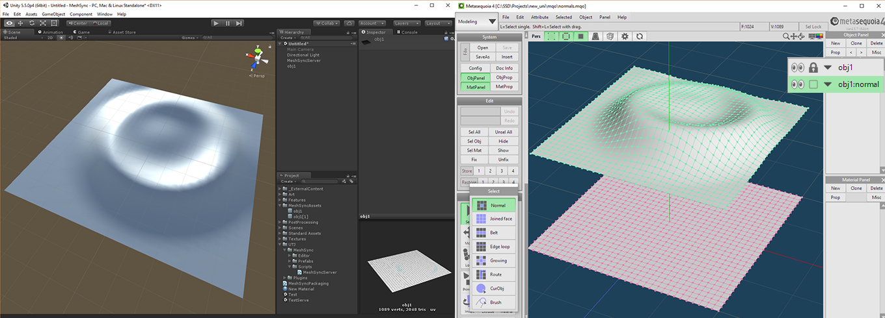

# MeshSync
[English](https://translate.google.com/translate?sl=ja&tl=en&u=https://github.com/unity3d-jp/MeshSync/) (by Google Translate)

モデリングツール [メタセコイア](http://www.metaseq.net/) 上の編集をリアルタイムに Unity に反映させるツールです。ゲーム上でどう見えるかをその場で確認しながらモデリングすることを可能にします。  
また、Unity のシーンをそのままメタセコイアに取り込むこともできます。気になった点をその場で確認したい場合や、Unity をモデリングの補助に使うといった用途がに使えます。

Unity とメタセコイア両方のプラグインとして機能します。
Unity は 5.4 以上 (64bit Windows)、メタセコイアは 3 系と 4.5.6 以降 (32bit, 64bit Windows) に対応しています。

## 使い方
- Unity 側
 - [このパッケージ](https://github.com/unity3d-jp/MeshSync/releases/download/0.7.3/MeshSync.unitypackage) をプロジェクトにインポートします。
 - メニュー GameObject -> MeshSync -> Create Server でサーバーオブジェクトを作成します。
 - このサーバーオブジェクトが同期処理を担当します。これがシーン内になければ同期できません。
- メタセコイア側
 - [このプラグイン](https://github.com/unity3d-jp/MeshSync/releases/download/0.7.3/UnityMeshSync.for.Metasequoia.zip) をインストールします。プラグインのタイプは Station です。
 - パネル -> Unity Mesh Sync を開き、"Auto Sync" をチェックします。
 - Auto Sync がチェックされている間は編集が自動的に Unity 側に反映されます。Auyo Sync が無効でも "Manual Sync" ボタンを押すことで手動で反映できます。
  - "Import Unity Scene" を押すと現在 Unity で開かれているシーンをインポートします。

## メタセコイア側解説

同期は TCP/IP を介して行われるため、メタセコイアを動かすマシンと Unity を動かすマシンが別でも同期させることができます。その場合、クライアントであるメタセコイア側は設定が必要になります。"Unity Mesh Sync" パネルの "Server : Port" をリモートマシンのアドレスに設定してください。

### 対応している機能、していない機能
- ミラーリング、スムーシングは Unity にも反映されます。
 - ただし、ミラーリングには若干挙動の違いがあります。"左右を接続した鏡面" は距離 0 の頂点しか接続されません。
- メタセコイアで非表示のオブジェクトは Unity でも非表示になります。非表示のオブジェクトはメッシュの内容は送られないので、シーン内にオブジェクトが増えて同期が重くなってきた場合適切に非表示にすることで同期も速くなるはずです。
- マテリアルは Unity には反映されませんが、マテリアル ID に応じて適切にサブメッシュに分割されます。
- サブディビジョンやメタボールはフリーズするまで Unity には反映されません。
- ボーンは現在未対応です。
- Unity のシーンをインポートしてきた場合の Skinned Mesh の編集にも制限があります。ウェイトの編集およびトポロジが変わる編集は受け付けません。頂点の移動と法線の編集 (後述) のみ反映できます。

### 法線転写
 メタセコイア側で名前に ":normal" を含むオブジェクトは法線転写用オブジェクトとして認識され、Unity 側では法線だけが転写されます。  
 例えばメタセコイア側に "Hoge" と "Hoge:normal" というオブジェクトがあった場合、Unity 側では "Hoge" オブジェクトのみが生成され、その法線はメタセコイア側の "Hoge:normal" のものになります。  
 法線用オブジェクトは対応するオブジェクトとトポロジが同じ (= 頂点数とインデックスが一致) である必要があります。違う場合、無視されます。  

## Unity 側解説

### マテリアルリスト
MesySyncServer はマテリアルのリストを保持しています。
このリストはメタセコイア側のマテリアルリストに対応しており、このリストにマテリアルを設定すると対応するオブジェクトに適切にアサインされます。

### アセット化
メタセコイア側の編集によって生成された Mesh 郡はそのままではそのシーン内にしか存在できないオブジェクトです。他のシーンやプロジェクトへ持ち出せるようにするにはアセットファイルとして保存する必要があります。MeshSyncServer の "Export Mesh" ボタンを押すとそのアセット化が行われます。("Asset Export Path" で指定されたディレクトリにファイルが生成されます)  
また、Unity からメタセコイアへインポートしたモデルを編集した場合、安全のため Unity 側では元の Mesh には手を加えず、新規に生成した Mesh で編集を受け取って表示します。"Export Mesh" はこの場合の元のアセットへの変更の反映も行います。

### ライトマップ UV
Unity でライトマップを使う場合、UV は通常のとは別の専用のものが用いられます。
通常はモデルインポート時に自動的に生成されますが、本プラグインでメタセコイアから受信したモデルにはそれがありません。  
MesySyncServer の "Generate Lightmap UV" ボタンを押すとそのライトマップ用 UV を生成します。
この処理は結構時間がかかるのでご注意ください。

### ランタイム対応
本プラグインはその性質上エディタでのみの使用を想定しており、意図せず最終ビルドに残してしまった場合想定外の動作を招く可能性があります。そのため、**意図的に Standalone でビルドするとエラーが出るようにしてあります**。  
もし最終ビルドにも残したい場合、MeshSyncServer.cs の ErrorOnStandaloneBuild() の中を適当にコメントアウトしてください。マテリアルリストを構築できない点以外はランタイムでも大体動作します。

## その他
- 同期は TCP/IP で全メッシュの内容を送りつけるという力技で実現されています。  
- メッシュの変換処理はほぼ全てサーバー (Unity) 側で行うため、ツール側はメッシュを送るだけの単純な処理で済みます。このため、メタセコイア以外のツールへの対応もそれほど難しくないと思われます。今後対応ツールを増やすかもしれません。  
- 本プラグインをソースからビルドするには、このリポジトリを clone して VisualStudio2015 で Plugin/MeshSync.sln を開いてビルドするだけで済むはずです。  

## ライセンス
[MIT](LICENSE.txt)
