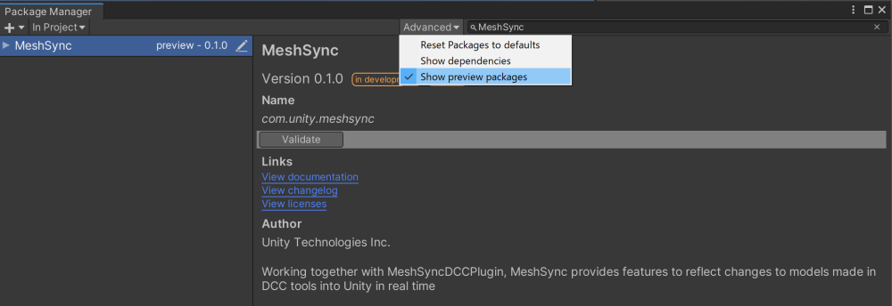

# Other Languages
- [日本語](Readme_JP.md)

# MeshSync

Working together with [MeshSyncDCCPlugins](https://github.com/Unity-Technologies/MeshSyncDCCPlugins), MeshSync is a package for synchronizing meshes/models editing in DCC tools into Unity in real time. 
This allows devs to immediately see how things will look in-game while modelling.  

MeshSync is currently a preview package, and therefore the installation requires preview packages to be enabled.

* Unity 2019.x  
  Open [Package Manager](https://docs.unity3d.com/Manual/upm-ui.html) and ensure that **Show preview packages** is checked. 
  Then, search for MeshSync.
  
  
* Unity 2020.x  
  Steps to enable preview packages:
  1. Go to Edit > Project Settings
  1. Select Package Manager in the Project Settings window
  1. Check **Enable Preview Packages** checkbox
  1. Click **I understand**
  
  Then, open [Package Manager](https://docs.unity3d.com/Manual/upm-ui.html) and search for MeshSync.

## Supported Platforms

- Windows 64 bit
- Mac
- Linux

# Basic usage

From the **GameObject** menu, choose **MeshSync > Create Server** to create a server object.  
This object has [MeshSyncServer](Documentation~/en/MeshSyncServer.md) component that handles the sync process.

# Settings

Various MeshSync related settings, including DCC Tools integration, can be configured on the 
[Project Settings](Documentation~/en/ProjectSettings.md) window.

# Advanced Features
- [SceneCache](Documentation~/en/SceneCache.md)

# Plugins
- [Building](Plugin~/Docs/en/BuildPlugins.md)

# License
- [License](LICENSE.md)
- [Code of Conduct](CODE_OF_CONDUCT.md)
- [Third Party Notices](Third%20Party%20Notices.md)
- [Contributing](CONTRIBUTING.md)

#  Related Tools
- [NormalPainter](https://github.com/unity3d-jp/NormalPainter): Tool for editing vectors in Unity
- [BlendShapeBuilder](https://github.com/unity3d-jp/BlendShapeBuilder): Tool for building BlendShapes in Unity

