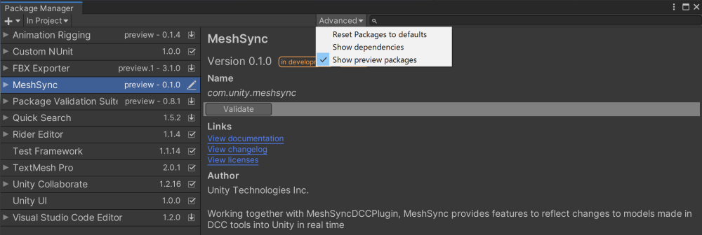
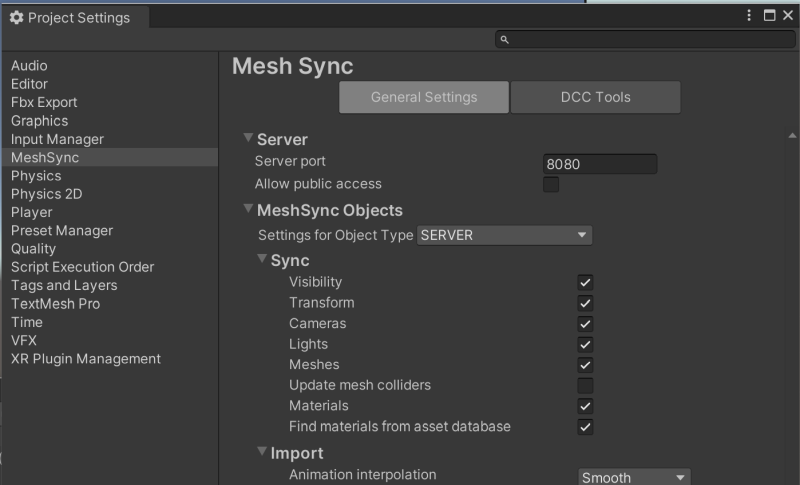

# 他の言語
- [English](Readme.md)

# MeshSync

[MeshSyncDCCPlugins](https://github.com/Unity-Technologies/MeshSyncDCCPlugins) と連携し、
MeshSync は DCC ツール上のモデルの編集をリアルタイムに Unity に反映させるためのパッケージです。  
ゲーム上でどう見えるかをその場で確認しながらモデリングすることを可能にします。

インストールは [Package Manager](https://docs.unity3d.com/Manual/Packages.html)
経由で行います。  
MeshSync を検索する際、*Show preview packages* にチェックが付いているかを確認してください。

## 動作環境

- Windows 64 bit
- Mac
- Linux

# 基本的な使い方

**GameObject** メニューから **MeshSync > Create Server** でサーバーオブジェクトを作成します。
このサーバーオブジェクトが同期処理を担当する [MeshSyncServer](Documentation~/en/MeshSyncServer.md) のコンポーネントを持っています。

# 設定

DCC ツールの統合などといった、様々な MeshSync の設定を 
[Project Settings](Documentation~/jp/ProjectSettings.md) ウィンドウで設定することができます。

# アドバンスト 機能
- [SceneCache](Documentation~/jp/SceneCache.md)

# プラグイン
- [ビルド](Plugin~/Docs/en/BuildPlugins.md)

# ライセンス
- [License](LICENSE.md)
- [Code of Conduct](CODE_OF_CONDUCT.md)
- [Third Party Notices](Third%20Party%20Notices.md)
- [Contributing](CONTRIBUTING.md)

#  関連ツール
- [NormalPainter](https://github.com/unity3d-jp/NormalPainter): Unity 上で法線を編集できるようにするツール
- [BlendShapeBuilder](https://github.com/unity3d-jp/BlendShapeBuilder): Unity 上で BlendShape を構築できるようにするツール

