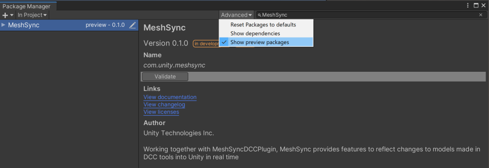
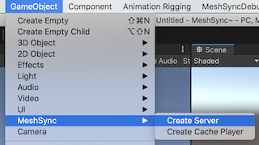
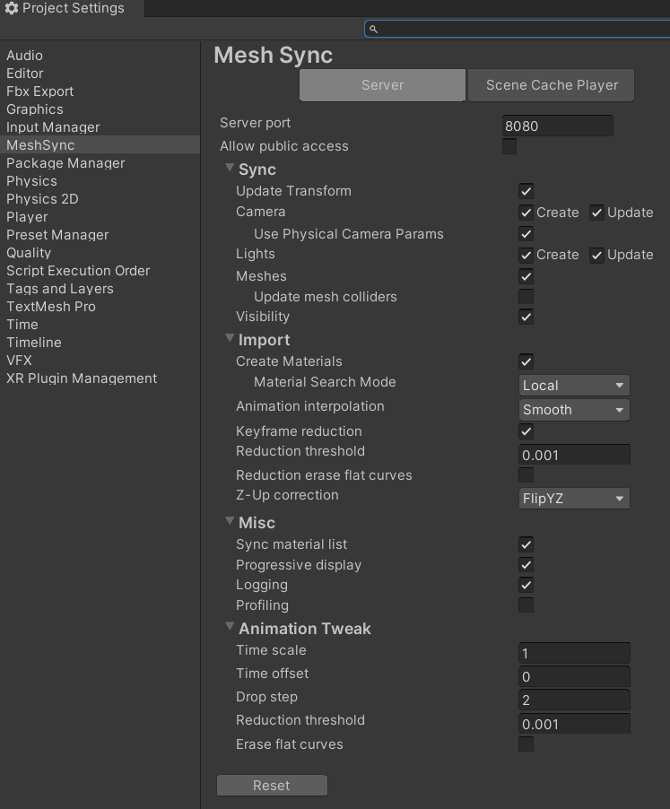
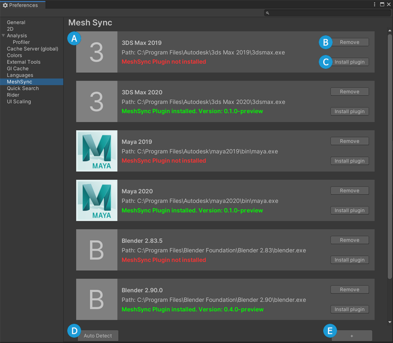

# 他の言語
- [English](Readme.md)

# MeshSync

[MeshSyncDCCPlugins](https://github.com/Unity-Technologies/MeshSyncDCCPlugins) と連携し、
MeshSync は DCC ツール上のモデルの編集をリアルタイムに Unity に反映させるためのパッケージです。
ゲーム上でどう見えるかをその場で確認しながらモデリングすることを可能にします。

MeshSync は現在プレビューパッケージとして存在し、
インストールの手順は Unity のバージョンによって少々違います。

* Unity 2019.x  
  
  1. [パッケージマネージャー](https://docs.unity3d.com/ja/current/Manual/upm-ui.html)を開く
  2. **Show preview packages** にチェックが付いているかを確認する
  3. *MeshSync*　を検索する
  
* Unity 2020.1  
  
  1. [パッケージマネージャー](https://docs.unity3d.com/ja/current/Manual/upm-ui.html)を開く
  2. **+** ボタンをクリックし、**Add package from git URL** を選択する
  3. `com.unity.meshsync@` とそれに続くバージョンを記入する。  
     例：`com.unity.meshsync@0.2.5-preview`
  
## 動作環境

- Windows 64 bit
- Mac
- Linux

# 基本的な使い方

**GameObject** メニューから **MeshSync > Create Server** でサーバーオブジェクトを作成します。
このサーバーオブジェクトが同期処理を担当する [MeshSyncServer](Documentation~/jp/MeshSyncServer.md) のコンポーネントを持っています。

# 設定

MeshSync のコンポネントに対するデフォルト設定は
[プロジェクト設定](Documentation~/jp/ProjectSettings.md) ウィンドウで設定することができます。

同様に、DCC ツールとの統合は
[環境設定](Documentation~/jp/Preferences.md) ウィンドウで設定することができます。

# アドバンスト 機能
- [SceneCache](Documentation~/jp/SceneCache.md)

# プラグイン
- [ビルド](Plugin~/Docs/en/BuildPlugins.md)

# ライセンス
- [License](LICENSE.md)
- [Code of Conduct](CODE_OF_CONDUCT.md)
- [Third Party Notices](Third%20Party%20Notices.md)
- [Contributing](CONTRIBUTING.md)

#  関連ツール
- [NormalPainter](https://github.com/unity3d-jp/NormalPainter): Unity 上で法線を編集できるようにするツール
- [BlendShapeBuilder](https://github.com/unity3d-jp/BlendShapeBuilder): Unity 上で BlendShape を構築できるようにするツール

